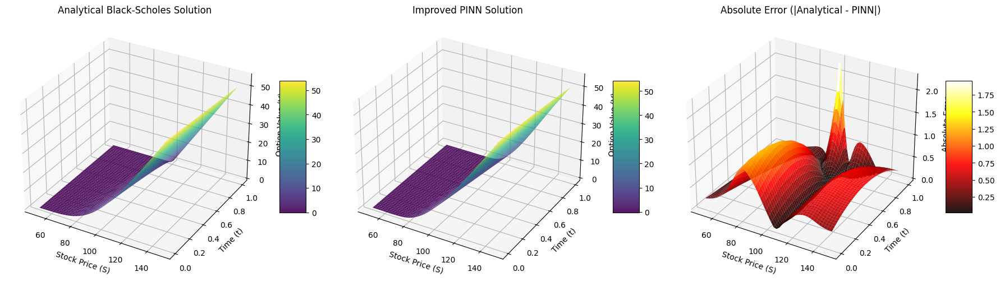
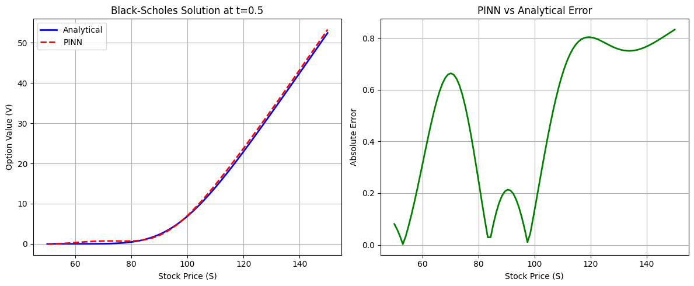
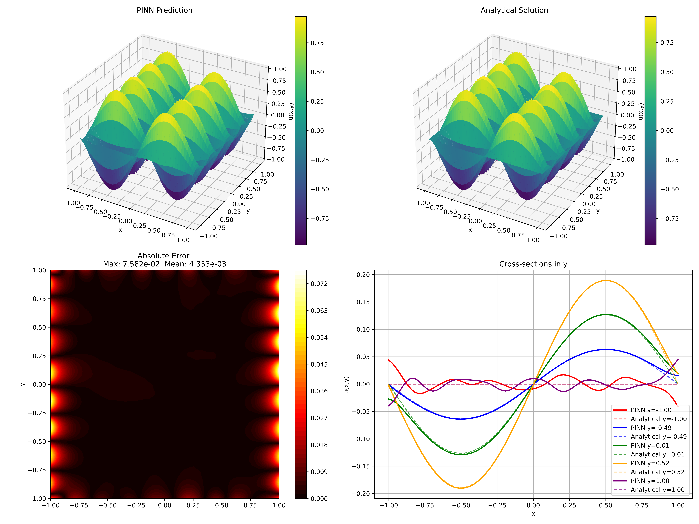

# SIG Math Fall 2025

This is the repository for ACM's SIG Math for Fall 2025 focusing on solving Partial Differential Equations with Physics Informed Neural Netowrks.

## Gallery
This section will be holding the benchmarks of the trained models as we moving throughtout the semester

### Heat equation


### Black-Scholes equation



### Helmholtz equation


## Contributing guide 

If you are interesting in contributing to this. There are 2 ways that you can contribute to this project:

### Write access

To be be added directly with write access to this repository, ping on the SIG Math channel your GitHub ID and you will be added to a group with write access.

Once you are a member with write access, you can clone, work and make pull requests to the repo as follows: (This requires [git](https://git-scm.com/install/) to be installed and working locally).

Open the terminal at the directory (folder) where you want to download the code:
- <b> Cloning the repository: </b> Run `git clone https://github.com/acm-uic/SIG-Math-2025.git`
- <b> Move into the cloned repo:</b> `cd SIG-Math-2025` 
- <b> Make your own branch: </b> `git checkout -b <your-branch-name>`

From here, you should be able to make your local change as see fit and when you are ready to have your code be part of the repo. Do
```
git add .
git commit -m "<your-commit-message>"
git push
```
and create a [pull-request](https://docs.github.com/en/pull-requests/collaborating-with-pull-requests/proposing-changes-to-your-work-with-pull-requests/creating-a-pull-request).

### Forking 
Another way to contribute is with [forking](https://docs.github.com/en/pull-requests/collaborating-with-pull-requests/working-with-forks/fork-a-repo) this repository and make you changes as you see fit to your fork. Afterwards, feel free to create a [pull-requests](https://docs.github.com/en/pull-requests/collaborating-with-pull-requests/proposing-changes-to-your-work-with-pull-requests/creating-a-pull-request-from-a-fork) from your fork.

## Next steps 
Feel free to tackle any of the PINN models listed or develop one of your own. We do not have to be limited to this however, if you have a more novel way to approach setting up problems like analyzing data to calibrate parameters instead of using static ones, you are free to develop and suggest it and of course, contribute!